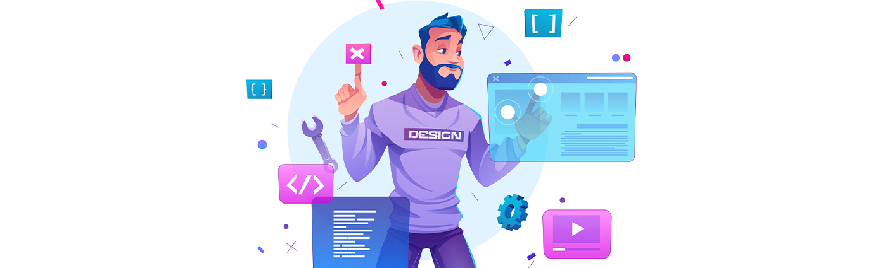

<h2>Hello 👋</h2>

I'm <strong>Keerthi Vibisan</strong>, <strong>Full Stack Developer</strong>

My Personal Portfolio <a href = "https://www.keerthivibisan.tech" target = "_">KEERTHI VIBISAN</a>

<!-- <h2>📌 Checkout My Works</h2>
1. DocsOnline [📄] - <a href="https://doc.bitsathy.ac.in/login" target="_">https://doc.bitsathy.ac.in/login</a>
 
2. ExpenseOnline [💹] - <a href="https://expenseonline.herokuapp.com/login" target = "_">https://expenseonline.herokuapp.com/login</a>
 
3. YaaRaa Technologies [ 🏢 Intern ] - <a href="https://yaaraa.in/" target = "_">https://yaaraa.in/</a> -->
<!--   -->
<!-- 4. HackerRank - <a href = "https://www.hackerrank.com/keerthivibisan" target = "_">https://www.hackerrank.com/keerthivibisan</a> -->

<h2>Currently Student at 📚</h2>
    Bannari Amman Institute of Technology
<h3>Year of Graduation 🎓</h3>
    2024, will be my year of Graduation.

<h2>My Current Skill Set 💻</h2>

  

<h2>👀 Stats</h2>

  

  <b>Overall GitHub Stats</b>  
       
  

  <!-- 

    
  
 -->

<h3>📬 Reach Me</h3>

  

<!--
**Keerthi-Vibisan-S/Keerthi-Vibisan-S** is a ✨ _special_ ✨ repository because its `README.md` (this file) appears on your GitHub profile.

Here are some ideas to get you started:

- 🔭 I’m currently working on ...
- 🌱 I’m currently learning ...
- 👯 I’m looking to collaborate on ...
- 🤔 I’m looking for help with ...
- 💬 Ask me about ...
- 📫 How to reach me: ...
- 😄 Pronouns: ...
- ⚡ Fun fact: ...
-->
